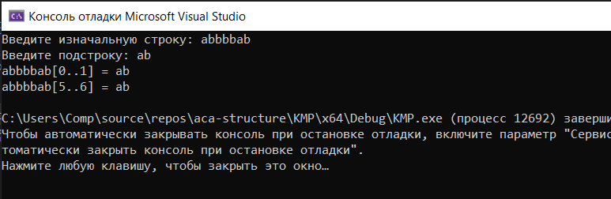

[Вернуться на главную](../README.md)

# Алгоритм Кнута-Морриса-Пратта



[Код программы](main.cpp)

### Алгоритм

Префикс-функция от строки s равна массиву __π__, где __π[i]__ обозначает длину максимального префикса строки ```s[0..i]```, совпадающего с её суффиксом. Тривиальные случаи (префикс равен суффиксу и равен всей строке) не учитываются.

Важное свойство: ```π[i]≤π[i−1]+1```. То есть префикс-функция от следующего элемента не более чем на 1 превосходит префикс-функцию от текущего. Случай ```π[i]=π[i−1]+1``` легко изобразить.

То есть верно следующее утверждение (в 0-индексации):
```
s[i]=s[π[i−1]]⇒π[i]=π[i−1]+1
```

Этот случай достаточно тривиален. Но что если ```s[i]≠s[π[i−1]]```? Хотелось бы найти такую длину j, что ```s[0..j−1]=s[i−j..i−1]```, но при этом ```j<π[i−1]```. Если ```s[i]=s[j]```, то ```π[i]=j+1```. На самом деле, длина j уже была найдена в процессе нахождения префикс-функции. А именно, ```j=π[π[i−1]−1]```.

Если же длина _j_ также не подходит ```(s[i]≠s[j])```, просто ещё раз уменьшим её по такой же формуле: ```j=π[j−1]```. Таким образом будем пытаться продолжить префикс длины _j_, пока _j_ не станет равно 0. В таком случае просто сравним ```s[i]``` с ```s[0]```, и в зависимости от результата присвоим ```π[i]=0``` или _1_.