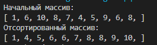

# Сортировка подсчетом (Counting sort)

Сортировка подсчетом — простейший способ упорядочить массив за линейное время. Применять его можно только для целых чисел, небольшого диапазона, т.к. он требует **O(M)** дополнительной памяти, где *M* — ширина диапазона сортируемых чисел. Алгоритм особо эффективен когда мы сортируем большое количество чисел, значения которых имеют небольшой разброс — например: массив из _1000000_ целых чисел, которые принимают значения от _0_ до _1000_.

1. Дан массив из **N** чисел в диапазоне от _1_ до _1000_.
2. Подсчитаем сколько раз встречается каждый элемент массива:
    * Создаем вспомогательный массив из _1000_ счетчиков, заполним его нулями.
    * Обойдем главный массив, при этом для каждого элемента вспомогательного массива увеличим счетчик: ```Seconds[Value]++```
3. Обойдем вторичный массив, при этом для каждого его *i*-того элемента выведем значение _i_ столько раз, сколько он встречается в главном массиве.

### Результаты работы:
