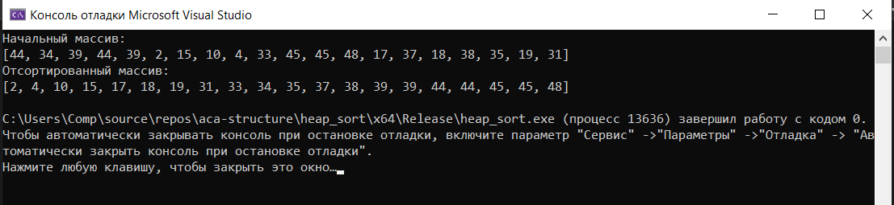

[Вернуться на главную](../README.md)

# Пирамидальная сортировка (Heap Sort)

### Результаты работы:

[Код программы](main.cpp)

Пирамидальная сортировка (или сортировка кучей, HeapSort) — это метод сортировки сравнением, основанный на такой структуре данных как двоичная куча. Она похожа на сортировку выбором, где мы сначала ищем максимальный элемент и помещаем его в конец.

Двоичная куча — это законченное двоичное дерево, в котором элементы хранятся в особом порядке: значение в родительском узле больше (или меньше) значений в его двух дочерних узлах. Первый вариант называется _max-heap_, а второй — _min-heap_. Куча может быть представлена двоичным деревом или массивом.

Алгоритм сортировки:

1. Постройте _max-heap_ из входных данных.
2. На данном этапе самый большой элемент хранится в корне кучи. Замените его на последний элемент кучи, а затем уменьшите ее размер на _1_. Наконец, преобразуйте полученное дерево в _max-heap_ с новым корнем.
3. Повторяйте вышеуказанные шаги, пока размер кучи больше _1_.
