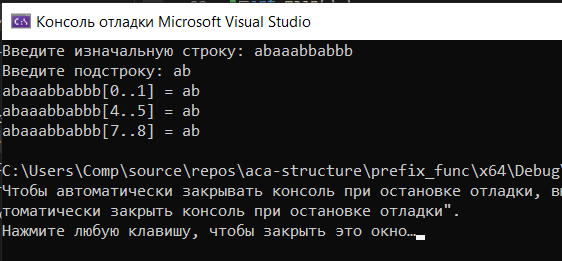

[Вернуться на главную](../README.md)

# Алгоритм Кнута-Морриса-Пратта



[Код программы](main.cpp)

### Алгоритм

Здесь и далее считаем, что символы в строках нумеруются с 0.

Определим префикс-функцию от строки s в позиции i следующим образом: 
```
π(s,i)=
maxk=1…i{k:s[0…k−1]=
s[i−k+1…i]}
```
Если мы не нашли такого k, то ```π(s,i)=0```.

