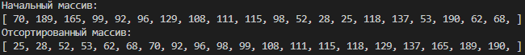

# Быстрая сортировка (Quick Sort)

Схема алгоритма достаточно тривиальная:

1. Выбираем опорный элемент в массиве. Обычно это центральный элемент.
2. Разделить массив на две части. Все элементы из правой части которые меньше опорного элемента перекидываются в левую часть. С левой частью анологично.
3. Рекурсивно повторять действие __2__ в левой и правой части.

### Результаты работы:
