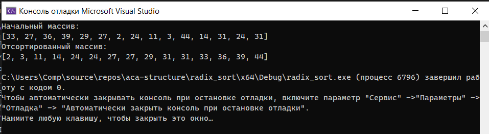

[Вернуться на главную](../README.md)

# Поразрядная сортировка (Radix sort) _(LSD - по младшим разрядам)_

[Код программы](main.cpp)

### Результаты работы:

Массив несколько раз перебирается и элементы перегруппировываются в зависимости от того, какая цифра находится в определённом разряде. После обработки разрядов (всех или почти всех) массив оказывается упорядоченным. При этом разряды могут обрабатываться в противоположных направлениях - от младших к старшим или наоборот.

Элементы перебираются по порядку и группируются по самому младшему разряду (сначала все, заканчивающиеся на 0, затем заканчивающиеся на 1, ..., заканчивающиеся на 9). Возникает новая последовательность. Затем группируются по следующему разряду с конца, затем по следующему и т.д. пока не будут перебраны все разряды, от младших к старшим.

Точное название способа **LSD radix sort** (_Least significant digit radix sorts_) - поразрядная сортировка по наименьшей значащей цифре.

Есть два способа реализации, через "ведра" и создавая каждый раз новый масив.
